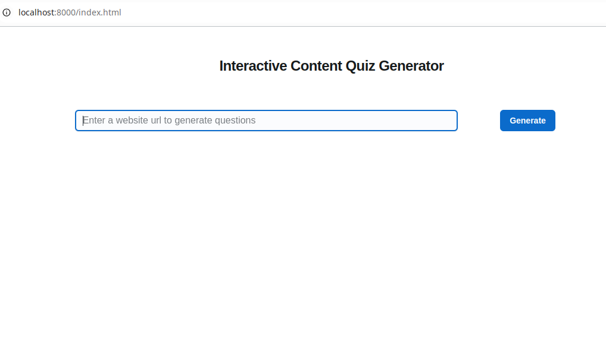
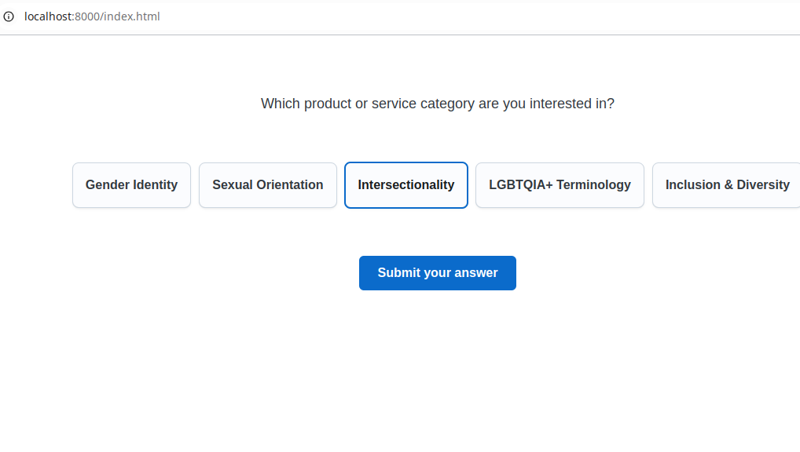

# Introduction
* " The goal of this mini-challenge is to build a website that takes a URL as input, scrapes the content of that site, and generates a question with multiple-choice options based on the content. The aim is to classify the visitor’s intent. "

# Build & Run
* Nevigate to "back" directory. 
* Rename "ai_api_adapter_example.py" to "ai_api_adapter.py". Implement your AI api call and initialization in the function "callApi" and "prepareApi".
* In the file "unpackfront.sh", set "MYIPADDR" as your IP address. Run `bash unpackfront.sh` and `bash run.sh`.

# Snapshots

